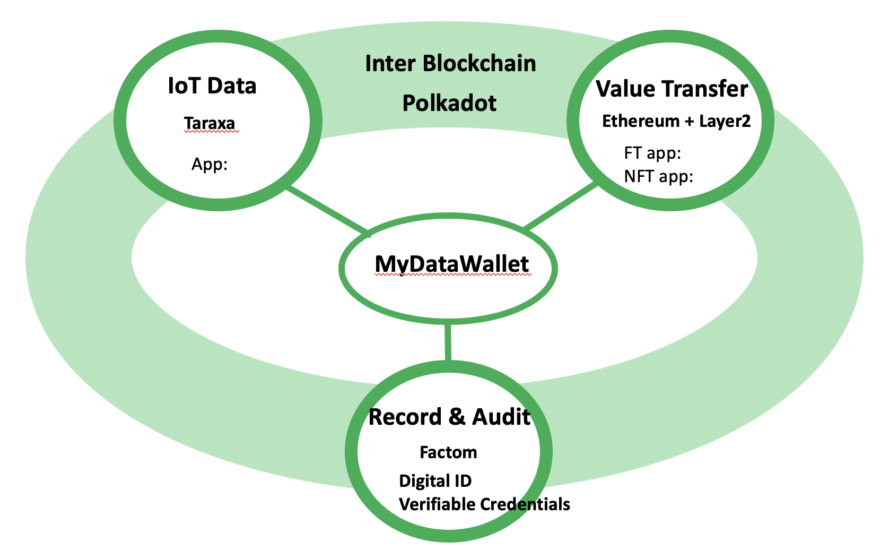

# Blockchain Sphere

## ・Every application required a blockchain which meets the application needs.
## ・There are three type of Blockchains;
		・Value transition
		・Data recording and auditing
		・IoT Data
		
		

## ・These blockchains are connected and their data are exchanged through the InterBlockchain.

## ・As the center of the sphere, each individual owns its wallet and its personal data.

